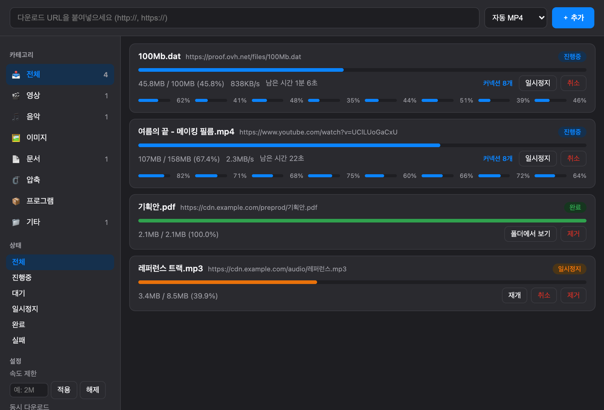

# Mac DM

A fast, IDM-style download manager for macOS — multi-connection segmented
downloads, resume, a Chrome capture extension, HLS/stream saving, and YouTube
support via `yt-dlp`. CLI, GUI, and browser all drive **one shared engine**.

[](https://github.com/Gwani-28/mac-dm/actions/workflows/ci.yml)
[](LICENSE)


**English** | [한국어](README.ko.md)



> Built for personal use. You are responsible for complying with the terms of
> service and copyright of any site you download from. See
> [Responsible use](#responsible-use).

## Features

- **Segmented downloads** — splits a file into N parallel HTTP `Range`
  connections (default 8) for higher throughput; automatically falls back to a
  single connection when the server doesn't support ranges.
- **Resume** — interrupt any download (Ctrl-C, pause, crash, reboot) and it
  continues from where it left off. Restart-safe: the daemon rebuilds its queue
  from disk and finishes in-flight jobs.
- **Per-connection progress (IDM-style)** — see each connection's own bar and
  percentage in the GUI, or with `dm show <id>` in the terminal.
- **Background daemon** — the engine runs as a headless daemon over a local
  Unix socket. CLI, GUI, and the Chrome extension are all thin clients of the
  same daemon, so a download added anywhere shows up everywhere.
- **Queue, concurrency & rate limiting** — cap simultaneous downloads
  (`dm concurrent N`) and total speed (`dm limit 2M`), shared across all jobs.
- **Chrome capture** — an extension intercepts browser downloads and hands them
  to the daemon (passing cookies/referer for authenticated files).
- **HLS / streams** — detects `.m3u8` and downloads + merges with `ffmpeg`.
- **YouTube & 1000+ sites** — routes streaming-site URLs to `yt-dlp`, picks the
  best video+audio, and merges to a QuickTime-friendly MP4. Optional quality
  selection (`auto`, `1080p`, `720p`, …).
- **Categories** — downloads auto-sort into video / audio / image / doc /
  archive / app, with a sidebar filter in the GUI.

## Architecture

```
Chrome extension (TS) ─┐
GUI (Tauri)           ─┼─►  daemon (Go, ~/.mac-dm/dm.sock)  ─►  download engine
CLI (dm)              ─┘        queue · concurrency · rate         Range split / resume
                               limit · restart recovery           HLS (ffmpeg) / yt-dlp
```

The engine is a standalone daemon, not embedded in the GUI or the extension.
Every client attaches to the same daemon over a private, user-only Unix socket
(`~/.mac-dm/dm.sock`), so state is consistent no matter how a download was
started.

## Requirements

- **macOS**
- **Runtime tools** (installed automatically by `install.sh` via Homebrew):
  - [`ffmpeg`](https://ffmpeg.org/) — HLS merging & MP4 remux
  - [`yt-dlp`](https://github.com/yt-dlp/yt-dlp) — streaming-site downloads
- **To build from source:**
  - [Go](https://go.dev/) 1.23+ (engine, CLI, native host)
  - [Rust](https://www.rust-lang.org/) + [Node.js](https://nodejs.org/) (GUI, via [Tauri 2](https://tauri.app/))
  - Google Chrome (for the capture extension)

## Install (from source)

```bash
git clone https://github.com/Gwani-28/mac-dm.git
cd mac-dm
./scripts/install.sh
```

`install.sh` builds `dm` and `dm-host` into `~/.mac-dm/bin`, ensures
`ffmpeg`/`yt-dlp` are present, builds the GUI (if Rust/Node are available) and
copies `MacDM.app` to `/Applications`, and registers the Chrome native
messaging host.

Then load the Chrome extension:

1. Open `chrome://extensions`
2. Enable **Developer mode**
3. **Load unpacked** → select the `extension/` folder

Uninstall with `./scripts/uninstall.sh` (add `--purge` to also remove job
history and logs).

## Usage

### CLI

```bash
dm add <URL>                 # queue a download (auto-starts the daemon)
dm add -q 1080p <URL>        # pick a video quality (streaming sites)
dm list                      # progress & speed for all jobs
dm show <ID>                 # per-connection bars (IDM-style)
dm pause / resume / cancel / rm <ID>
dm limit 2M | off            # global speed cap
dm concurrent 3              # max simultaneous downloads
dm daemon start | stop | status
dm download <URL>            # one-off download without the daemon
dm host install              # register the Chrome native messaging host
```

### GUI

Launch **MacDM.app**. Paste a URL, pick a quality if it's a video, and manage
everything (pause/resume/cancel, per-connection progress, category filter,
speed/concurrency settings) from the window. "Reveal in Finder" on completed
files.

### Chrome

With the extension loaded, downloads are captured automatically and sent to Mac
DM. On a video-site page (YouTube, etc.), click the extension → **Download this
video**. Right-click any link → **Download with Mac DM**.

## How it works

- **Merge without a merge step.** Instead of downloading N chunk files and
  concatenating them, the engine pre-allocates the full-size `.part` file and
  each worker `WriteAt`s its own byte range. Re-downloading a byte always lands
  at the same offset, so retries and resumes are idempotent and there is no
  "failed mid-merge" state.
- **Resume is a single number.** Each segment records how many bytes it has
  written; the metadata is flushed every second and on interrupt, and never runs
  ahead of what's on disk. If the server file changed (size/ETag mismatch), the
  resume is discarded rather than producing a half-old/half-new file.
- **Streaming split differs.** YouTube isn't a single file — it's separate,
  signed DASH video/audio streams, so it goes through `yt-dlp` (parallel
  fragments) rather than HTTP Range. `ffmpeg` merges them into MP4.

## Development

```bash
go build ./...        # engine, CLI, native host
go test ./...         # unit + integration tests
cd gui && npx @tauri-apps/cli dev    # run the GUI in dev mode
cd extension && npx tsc              # compile the extension TypeScript
```

Layout:

| Path | What |
|---|---|
| `cmd/dm` | CLI entry point |
| `cmd/dm-host` | Chrome native messaging host |
| `internal/downloader` | segmented download, resume, routing |
| `internal/daemon` | daemon, queue/scheduler, local HTTP API |
| `internal/httpclient` / `store` / `ratelimit` | probing, resume metadata, token bucket |
| `internal/hls` / `internal/ytdl` | ffmpeg (HLS) and yt-dlp (streaming) backends |
| `gui/` | Tauri app (vanilla HTML/JS/CSS front-end, zero JS libs) |
| `extension/` | Chrome MV3 extension (TypeScript) |

The Go side has **zero third-party module dependencies** — standard library
only. External tools (`ffmpeg`, `yt-dlp`) are invoked as subprocesses.

## Responsible use

This is a general-purpose download manager. When it downloads from streaming
sites via `yt-dlp`, **you are responsible** for respecting each site's terms of
service and applicable copyright law — use it only for content you have the
right to download (e.g. your own uploads, or material licensed for download).
It does **not** circumvent DRM or access protected content.

## Project status & roadmap

Actively developed. Every push runs `go build` / `go vet` / `go test` and an
extension type-check in [CI](https://github.com/Gwani-28/mac-dm/actions).
See the [**roadmap**](ROADMAP.md) for what's next (code signing, prebuilt
release binaries, a Homebrew tap, checksum verification, GUI localization) and
the [**changelog**](CHANGELOG.md) for release history.

## Community

- [Contributing guide](CONTRIBUTING.md)
- [Code of Conduct](CODE_OF_CONDUCT.md)
- [Security policy](SECURITY.md)
- Ideas & bugs → [open an issue](https://github.com/Gwani-28/mac-dm/issues/new/choose)

## License

[MIT](LICENSE) © 2026 Gwani-28

---

🇰🇷 **한국어 문서:** [README.ko.md](README.ko.md)
